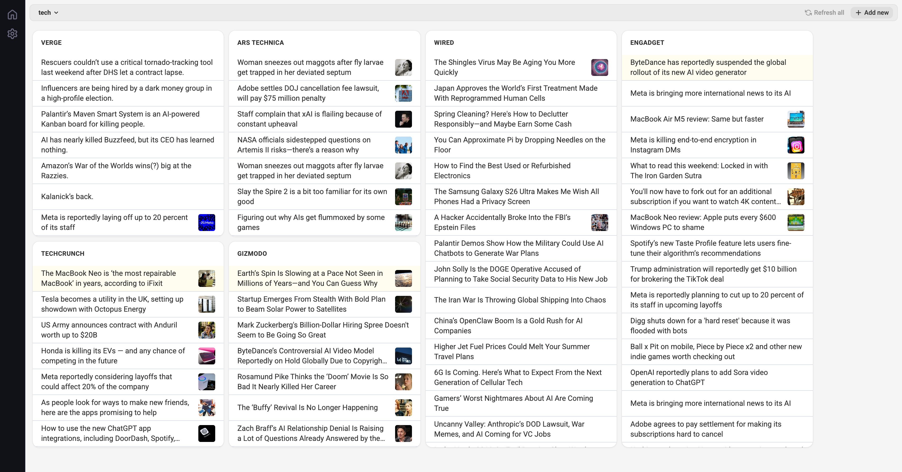

<p align="center">
  
</p>

# frontpage

[](https://github.com/odosui/frontpage/actions/workflows/ci.yml)

AI-powered website aggregator.

<p align="center">
  
</p>

## Motivation

Modern LLMs have become powerful enough and, more importantly, cheap enough to digest a website's front page and extract a list of articles — like an RSS feed, which many websites no longer provide. This project aggregates those results into a nice dashboard.

## Running with Docker

```bash
docker run -d \
  -p 3043:3043 \
  -v ~/.frontpage:/data/frontpage \
  -e OPENROUTER_API_KEY=your-key \
  -e FRONTPAGE_MODEL=google/gemini-3-flash-preview \
  hiquest/frontpage:latest
```

Or with docker compose — edit `docker-compose.yml` to set your API keys, then:

```bash
docker compose up -d
```

The app will be available at `http://localhost:3043`. Dashboard configs are stored in `~/.frontpage`.

## What model to use?

We are using the [OpenRouter](https://openrouter.ai/), so `OPENROUTER_API_KEY` is required.

I find the default model, `google/gemini-3-flash-preview` ($0.50 input, $3 output) to work pretty stable. But there are cheaper options, I'd recommend looking at what people are using in the [ranking page](https://openrouter.ai/rankings).

Local models are not yet supported, but we'll get there.
